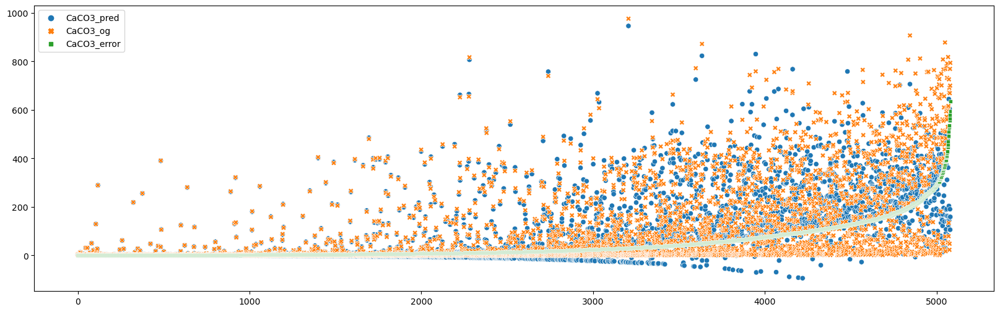

# AI4LSC

## Introduction

This readme serves as documentation for the project submission.

## Concept

The main idea was to provide an approach for exploration of soil data to gain new insight of correlation with the use of modern technologies. For this a data analysis was conducted with machine learning and a 3d visualtion tool that can be used from any modern browser. These two components are described in the following sections.

## Data Analysis

### Data source

The data source was the [LUCAS data](data/raw_data) from the years 2009, 2015, 2018 provided by the challangers. The microbiome sequencing data was not used due to time constraint.

### Data cleaning

The data had to be cleaned first to make it uniform between the three years. The following steps were done:

* The columns in the csv had different naming that needed to be understood and related to the other csv files with the information provided in the LUCAS reports.
* Duplicate or columns with lots of missing data were excluded.
* All values which where out of LOD were considered null as it was not clear to us if the data was really out of LOD or missing.

The process written in [LUCAS_Soil_Data_Overview.ipynb](data/LUCAS_Soil_Data_Overview.ipynb) does this and creates and output file [soil-merged.csv](data/soil-merged.csv) that is a uniform table of all three years combined.

*Figure 1: Overview of missing data represented as a black line*

The correlation matrix shows linear correlation between each feature. The following observations were made:

* pH H20 and pH CaCl2 had a correlation of 0.99 which means they have almost perfekt linear correlation. Therefore pH CaCl2 was taken out as a feature as it does not provide any new information.
* N and OC have a linear correlation of 0.91
* LAT(itude) and pH H20 have a linear correlation of 0.62

For a prediction feature we choose **CaCO3** as it has some missing data as shown in Figure 1 and has some correlations with different other features.

*Figure 2: Correlation matrix of the existing features higher than 0.2*

### Feature Engineering

To predict CaCO3 further steps where taken to possibly improve a prediction model. For this additional features where generated. In this step the previously generated [soil-merged.csv](data/soil-merged.csv) was used by the [feature_engineering.py](data/feature_engineering.py) script to generate additional columns that can be used as input for ML model.

The idea was to also include the CaCO3 values of neighboring LUCAS points to improve prediction the CaCO3 of a LUCAS point. The assumption was that the soil is mostly continous and not changing apruptly. The first step was to use a nearest neighbor algorithm based on longitude and latitude to find the nearest neighbors for each point. Figure 3, 4 and 5 show the connections of each point as a check if the implentation works as intended. It is not perfect as some connections are made between coasts of different islands. After that the POINT_ID where identified CaCO3 values where read and put as additional columns for each LUCAS points. The 4 nearest LUCAS points were chosen. The script produces the [ml_soil.csv](data/ml_soil.csv) that was used as a base for the machine learning model.

*Figure 3: Nearest neighbor for 2009 LUCAS points*

*Figure 4: Nearest neighbor for 2015 LUCAS points*

*Figure 5: Nearest neighbor for 2018 LUCAS points*

### Machine learning

#### Training and evaluation

The previously generated [ml_soil.csv](data/ml_soil.csv) was used as a base dataset for machine learning. The script [ml_prediction_CaCO3.ipynb](data/ml_prediction_CaCO3.ipynb) was used to train, evaluate and investigate a machine learning model to predict the CaCO3 values. For this the existing dataset was split into a train and test set. The test set was used to evaluate the models performance with an R2-Score.

Different approaches were investigated resulting in R2-score around 0.70 for different features. Figure 6 shows the model weights the nearest LUCAS point most followed by the pH H20 value. An analysis of the error *abs(prediction - true value)* in Figure 7 shows an indication of increasing error with increasing CaCO3 values. This is further supported by Figure 8 showing a linear correlation between error and true value of 0.59. This concludes that the model has problems correctly predicting higher CaCO3 values. One explanation is the distribution that there are many more low CaCO3 values than high as shown in Figure 9.

*Figure 6: Graph showing feature importance of the model.*

*Figure 7: True value (CaCO3_og), predicted value (CaCO3_pred) and the error (CaCO3_error) ordered by ascending error*

*Figure 8: Correlation matrix between True value (CaCO3_og), predicted value (CaCO3_pred) and the error (CaCO3_error)*

*Figure 9: Histogramm of CaCO3*

#### Model investigation

The exploration of a machine learning model could provide new insight on correlation of data and their features. <https://shap.readthedocs.io/en/latest/index.html> was used on the trained model to investigate the behaviour the full analysis is done in [ml_prediction_CaCO3.ipynb](data/ml_prediction_CaCO3.ipynb) at the end. Figure 10 shows an overview of the general impact of each feature with high or low value. E.g. Data with low K has pushed prediction for CaCO3 up in general, while high K pushed prediction in general down. Figure 11 shows the influence of pH H2O to the CaCO3 prediction. Interstingly it has a negative effect up to pH H2O of 7 and then prediction influence changes to positive effect in linear. Figure 12 shows an intresting behaviour where low K and high K have an opposite effect with increasing pH H2O values.

*Figure 10: The x-axis shows if the feature impacts the model prediction of higher or lower, Blue means low feature value and red high feature value, the thickness represents the distribution of feature points.*

*Figure 11: The predidiction is pushed down up to a pH H2O of 7. From 7 and above the influence of prediction increases linear.*

*Figure 12: With high K (red) and increasing pH H2O the prediction effect increases in negative direction. While with low K (blue) and increasing pH H2O the effect increases in the positive direction.*

## Visualization

### Data source

The visualization uses imputed data of the [soil-merged.csv](data/soil-merged.csv). This was created by basic KNN imputation [soil_imputation_knn.py](data/soil_imputation_knn.py) to use as a base for visualization.

tbd

## Conclusion and possible next steps

The models performance with an R2-score of 0.70 for CaCO3 prediction needs to be improved. LUCAS data of additional years and further investigation is needed to improve it. Also the possibity to predict other features like P or N can be investigated and what kind of data is necessary to do it. Maybe other data such as microbiome or meteorolical data is needed to predict such values accurately. The model exploration method can get new insight on model behaviour, that is espacially interesting with better performing models. This can be used as an explorative way to understand the model better and maybe even see new correlation or patterns. While this only shows correlation this could be used to start research investigating causality.

None of the team members where experts in soil, so some assumptions that were done in the project might not be ideal. The assumption that soil changes continously may be correct for untouched soil, but not for farming land. There is probably a strong break between a LUCAS point in a natural reserve and a neighboring point that is on farmland. For this the feature engineering needs to be improved to somehow consider this. Maybe considering the land use of the neighboring LUCAS and own LUCAS point a model could create some kind of simalarity matrix.

Figure 2 shows a linear correlation of 0.24 between survey month and pH H2O. While this is low it opens the question how soil changes during the year. Here it would also be interesting how microbiome changes and soil properties that can be measured in the lab. And if this can be put in a model for prediction.

## Appendix

### Categorical LUCAS Properties

#### Climate zones

1 Boreal and boreal to temperate
2 Atlantic
3 Sub-oceanic
4 Sub-oceanic to sub-continental
5 Subcontinental, partly arid
6 Temperate mountainous
7 Mediterranean semi-arid
8 Mediterranean temperate and sub-oceanic
9 Mediterranean mountainous

#### Land Cover - LC

A Artificial land
B Cropland
C Forest
D Scrubland
E Grassland
F Bareland
G Water
H Wetlands

<https://ec.europa.eu/eurostat/statistics-explained/index.php?title=Glossary:Land_cover>

##### Cropland
**Cereals**
B11 Common wheat
B12 Durum wheat
B13 Barley
B14 Rye
B15 Oats
B16 Maize
B17 Rice
B18 Triticale
B19 Other cereals

**Root crops**
B21 Potatoes
B22 Sugar beet
B23 Other root crops

**Non-permanent industrial crops**
B31 Sunflower
B32 Rape and turnip rape
B33 Soya
B34 Cotton
B35 Other fibre and oleaginous crops
B36 Tobacco

**Dry pulses, vegetables and flowers**
B41 Dry pulses
B42 Tomatoes
B43 Other fresh vegetables
B45 Strawberries

**Fodder crops**
B51 Clovers
B52 Lucerne
B53 Other Leguminous and mixtures for fodder
B54 Mix of cereals
B55 Temporary grassland

**Permanent crops**
B71 Apple fruit
B72 Pear fruit
B73 Cherry fruit
B74 Nuts trees
B75 Other fruit trees and berries
B76 Oranges
B77 Other citrus fruit and other permanent crops 
B81 Olive groves
B82 Vineyards
B83 Nurseries
B84 Permanent industrial crops

##### Woodlands
C10 Broadleaved and evergreen woodland
C20 Coniferous woodland
C30 Mixed woodland

##### Scrubland
D10 Shrubland with sparse tree cover
D20 Shrubland without tree cover

##### Graslands
E10 pastures under sparse tree or shrub cover,
E20 grassland without tree/shrub cover
E30 spontaneously re-vegetated surfaces

##### Wetlands
H11 inland marshes
H12 peat bogs

#### Land use - LU
U110 	Agriculture
U120 	Forestry
U130 	Fishing
U140 	Mining and quarrying
U150 	Hunting
U210 	Energy production
U220 	Industry and manufacturing
U310 	Transport, communication networks, storage and protective works
U320 	Water and waste treatment
U330 	Construction
U340 	Commerce, finance and business
U350 	Community services
U360 	Recreational, leisure and sport
U370 	Residential
U400 	Unused 

<https://ec.europa.eu/eurostat/statistics-explained/index.php?title=Glossary:Land_use>

#### NUTS Code

<https://ec.europa.eu/eurostat/web/nuts/nuts-maps>
